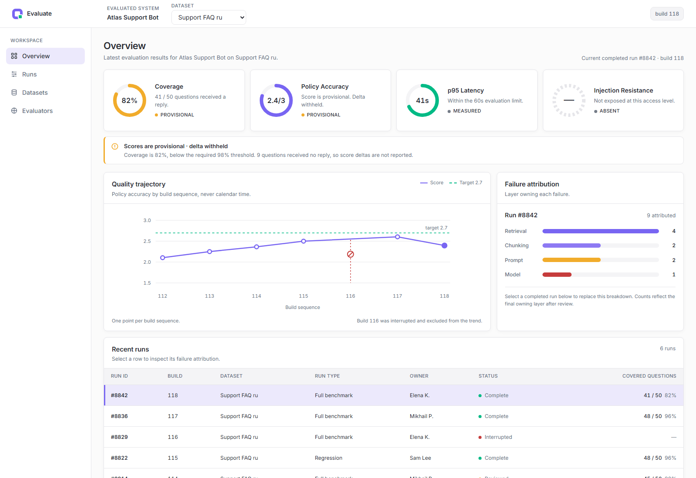
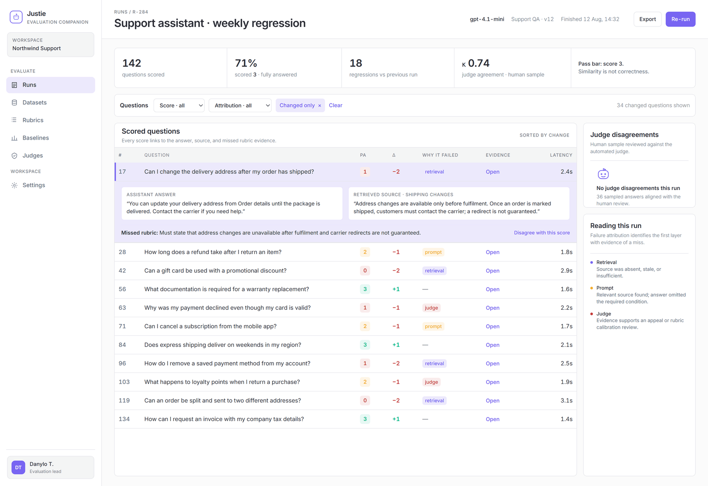
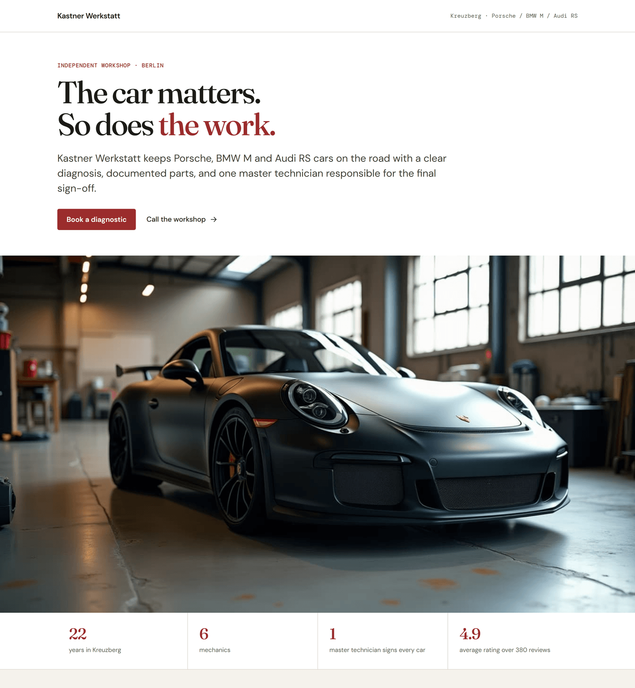

# Plumb

**Three models draw. A script checks. You choose.**

A plumb line does not draw anything. It hangs there and tells you whether the wall is straight,
and it is right whether or not you like the answer. This module draws — and then measures what
it drew.

## For builders, not design teams

The deliverable is a file that runs: HTML you commit, a PNG you post, a PDF you send. Not a
Figma document, not a stack of specification artefacts for a designer to interpret later.
**Plumb does not export to Figma and is not planning to** — the handoff here is the code.

If the step after "design" is "someone writes the code", this is the wrong tool. If the step
after is `git add`, it is the right one.

## It remembers, locally

`.memory/log.md` — one appended block per finished piece: what was made, which engine won, the
palette and faces chosen, where the file went, and what you asked to change. Plain markdown, on
your machine, gitignored. **No account, no cloud, no telemetry.**

The point is the second run. Plumb introduces itself **once**; after that it opens with what you
did last time and asks only what it does not already know. A tool that greets you from scratch
every morning is not being polite, it is not listening.

## Why it exists

A measured failure. Given a brief with 16 fixed hex values and a named typeface, a hosted
design assistant used **0 of the 16 colours** and **222 instances of a typeface the brief had
explicitly cancelled**. Three `gpt-5.6` engines given the same brief scored **14 of 14 each**
on the same check. Everything here follows from that number.

---

## What comes out



**A product screen.** The metric that could not be read shows `ABSENT · not exposed at this access
level` instead of a zero, and the banner states that score deltas are withheld while coverage sits
below the threshold. A failed read has no business looking like a measurement.



**A dense results table.** A row opens onto the answer, the retrieved source and the rubric line
that was missed, so a score can be argued with rather than only reported.



**A landing page.** Editorial serif over a grotesque body, one accent, and the figures collected
in a band under the hero rather than scattered through the copy.

All three came out of the same four commands. What separates them from an average result is not
the number of engines — it is that the brief carried numbers: named faces, hex values, a type
floor, a row height.

---

## What it does

```
look up what's current → brief → 3 engines in parallel → layout checked by code → contact sheet → you choose
```

- **It ships with a floor.** `templates/` holds five working screens the module produced itself —
  dashboards, an application shell, a results table whose rows open onto their evidence. Pass one
  as `--ref` and the run starts from a known-good bar instead of from a model's average taste.
  The clean run behind them scored 14/14 on palette compliance across every engine, 0 stray hex,
  charts in real inline SVG, at $0.08–0.11 per engine.
- **It looks before it draws.** The module searches for the best-*built* interfaces — in any
  sector — and pulls their real stylesheets for named faces, hex values and the radius scale,
  then writes those into the brief. It searches the client's own niche separately, and only for
  *what* goes on the screen. Searching the niche for styling finds competitors, not a quality
  bar: asked for "LLM evaluation dashboard design", the top vendor's interface was a decade
  behind. Left to its own taste a model returns an average of its training data — measured
  29 Jul, three engines given free rein converged on the same dated corporate look. Rules keep
  quality from falling; only looking keeps it current. Uses Claude Code's own search —
  **no extra API key, no second bill.**

- **Three engines, one brief.** ~$0.25 a run. Guessing which taste fits is more expensive
  than generating all three.
- **The layout gate is a script, not a prompt.** "Nothing overlaps and nothing falls off the
  page" is a sentence a model is free to ignore — and does. `check-layout.mjs` either passes
  or fails, with pixel counts.
- **The human judges taste.** Objective things (overflow, contrast, spec compliance, offline
  self-containment) are decided by code. Taste is decided by you, from one contact sheet.

## Install

Claude Code picks it up as a skill:

```bash
git clone https://github.com/yappet79/plumb ~/.claude/skills/plumb
```

Or use it as plain CLI — no agent, no subscription:

```bash
node scripts/bakeoff.mjs --brief brief.md --out ./out
node scripts/check-layout.mjs ./out/design-terra.html --container '.slide'
```

**Needs:** Node 20+ and Chrome. No `npm install` required — `sharp` is optional and only makes inlined photos ~30x smaller.
**Keys are yours:** `OPENAI_API_KEY` for the engines, `REPLICATE_API_TOKEN` for images.
Nothing is spent until you set one — the module has no account of its own and never reaches
into anyone else's.

## The tools

| script | what it decides |
|---|---|
| `bakeoff.mjs` | three engines in parallel, renders each, checks it against the brief's palette and type, builds the contact sheet |
| `check-layout.mjs` | eight layout invariants + JS errors. `0` clean · `1` violations · `2` **could not check** — which is not the same as clean |
| `theme.mjs` | six palettes with WCAG contrast computed, not assumed. Body 7.0, secondary 4.5, accent 3.0 |
| `embed-fonts.mjs` | inlines Google Fonts so "self-contained" is true offline, and verifies no external reference survives |
| `fill-slots.mjs` | photographs prepared once, dropped into every variant's `data-slot` frames — fair comparison, paid for once |
| `image.mjs` | Flux and Wan through Replicate |
| `render-png.mjs` | HTML → PNG a feed will accept: `--scale 2`, `--each .slide` for a whole carousel, `--hide` for screen furniture, and it freezes animation so two shots of one file match |
| `fit-deck.mjs` | scales a fixed-canvas deck to any window, so a 1600px slide stops running off a laptop |
| `pptx-check.mjs` | validates any `.pptx` — canvas size, empty slides, type floor, frames off-canvas — by unzipping it. Reads decks made elsewhere; this module does not generate them |

## What check-layout actually catches

Eight invariants, each earned from a real defect rather than invented:

- **overflow** — an element leaves the container that clips it
- **clipped** — content does not fit its own box and is cut (text only; a cropped photo under
  `object-fit: cover` is a technique, not a fault)
- **escapes** — an element leaves its parent *and* the container. Bleeding out of a text grid
  into the slide margin is deliberate and is not reported
- **spills** — text overruns its own box while overflow is visible: nothing is clipped, no
  boxes intersect, and the letters still land on the neighbouring column. This one is invisible
  to every other check
- **overlap** — two text blocks genuinely collide (both axes, not just box intersection —
  pulling a paragraph 7px under a heading is typography, not a collision)
- **offscreen** — the container itself does not fit the window. Every other rule measures
  content *against* the container, and so called a 1600px slide in a 1280px window flawless
  while the reader saw half a slide and a cut page number
- **busts-card** — a child crosses the edge of a parent that reads as a card (its own border or
  its own fill). `escapes` exempts this on purpose, and that exemption hid a results table whose
  fixed columns pushed the totals 42px outside the drawn box
- **covered** — text with something opaque painted on top of it. Every other rule compares text
  against text, so a card sitting over a paragraph passed them all. Decided by hit-testing the
  middle of the text, not by geometry, because geometry cannot say what is on top
- plus **JS errors**: a page that throws is broken even when it lays out perfectly

Two rules are opt-in, because both are properties of the medium rather than of layout:
`--margin N` (in a deck, panels reaching the edge are a device; it produced 100% noise on three
decks) and `--min-font N` — the readable floor. Pass the second for anything that will be seen
as an image in a feed: a 1200px-wide poster is displayed at ~390px on a phone, so 12px type
arrives as four physical pixels.

## Choose the medium before the pixels

"A presentation" is five different jobs, and the medium — not taste — decides the constraints.

| medium | when | what it costs |
|---|---|---|
| HTML deck | animation, one shareable file | only someone with the model can edit it |
| Poster / carousel | one image that must work in a feed, unaccompanied | density is the job — a resized slide fails it |
| PPTX | **the team edits it themselves** | boxes and shapes — this module verifies such files but will not draw them, see below |
| PDF | print, projector | no interaction |
| Canva | corporate brand kit, non-engineers editing | someone else's engine, connector only |
| Product UI | behaviour, not a picture | "pretty" is barely the point |

Beauty and "editable in PowerPoint" are goals that fight each other. Pick one.

## Floors beat wishes

Measured on the same product with the same three engines, twice:

| brief said | result |
|---|---|
| "make it beautiful, your call" | 9px type, cream paper texture, a screen that reads as a document |
| "nothing below 12px, card padding ≥ 20px, white ground, one recurring device" | all three engines complied |

A wish is interpreted. A number is executed. Constraints raise the floor; the layout
archetypes in `references.md` widen the spread — different jobs, do not confuse them.

## Decks fit the screen, not the other way round

A slide fixed at 1600×900 px loses its top line on any laptop where the browser chrome eats
part of the viewport. Design on the canvas, scale it to the device:

```css
.deck  { height: 100dvh; display: grid; place-items: center; overflow: hidden; }
.stage { width: 1600px; height: 900px;
         transform: scale(min(100vw / 1600, 100dvh / 900)); transform-origin: center; }
```

Then check at more than one viewport — `1600x900`, `1440x780`, `1280x700`. A deck that only
passes at its own canvas size has not been checked.

## Honest limits

- Visual QA of `.pptx` needs LibreOffice. Without it the check is structural only, and the
  module says so instead of implying the deck was reviewed.
- Measuring a page whose fonts load over the network measures a lottery — text wraps
  differently depending on what arrived first. Embed the fonts, then measure.
- The Canva branch is a connector, not a skill: it cannot be vendored into this repo.
- The taste judge is a human. An LLM judging design has the same blind spots as the LLM
  producing it, and we have the κ to prove judges look confident while scoring near chance.

## Licence

MIT.
